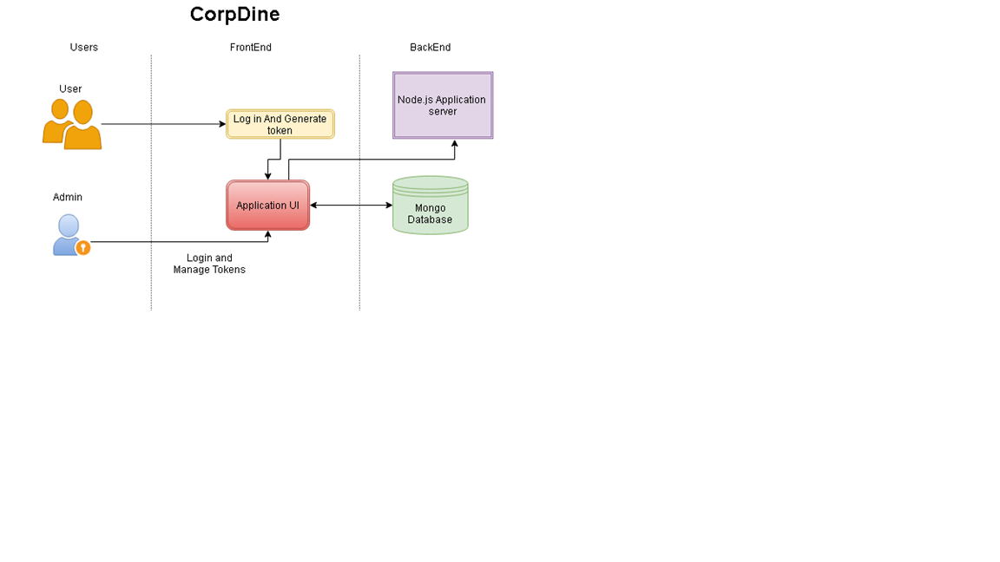
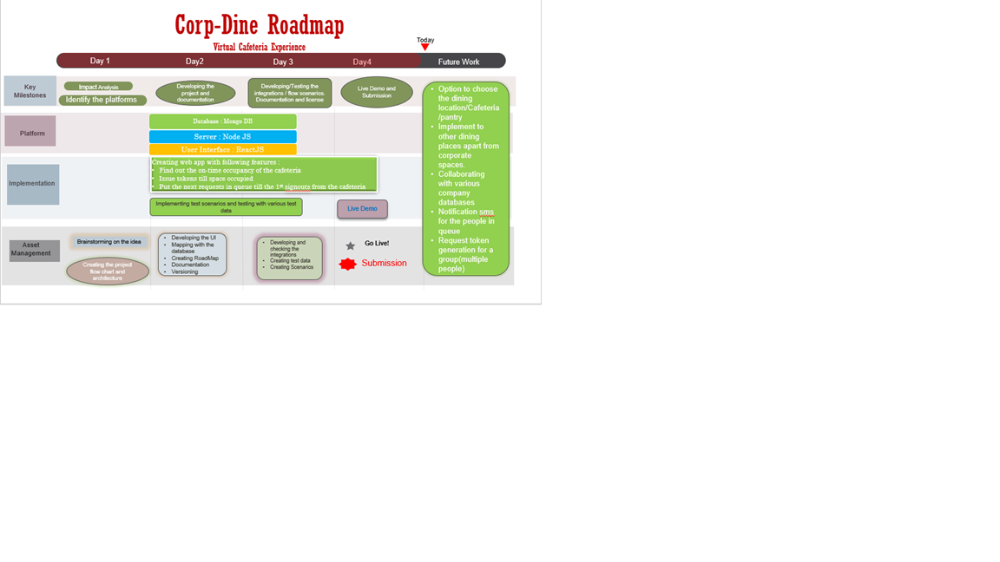

# Submission name

[](https://www.apache.org/licenses/LICENSE-2.0) [](https://callforcode.org/slack) [](https://code-and-response.github.io/Project-Sample/)

A basic GitHub repository example for Call for Code submissions and those projects that join the Code and Response initiative. Not all sections or files are required. You can make this as simple or as in-depth as you need.

*Read this in other languages: [English](README.md), [한국어](README.ko.md), [português](README.pt_br.md).*

## Contents

1. [Short description](#short-description)
1. [Demo video](#demo-video)
1. [The architecture](#the-architecture)
1. [Long description](#long-description)
1. [Project roadmap](#project-roadmap)
1. [Getting started](#getting-started)
1. [Running the tests](#running-the-tests)
1. [Live demo](#live-demo)
1. [Built with](#built-with)
1. [Contributing](#contributing)
1. [Versioning](#versioning)
1. [Authors](#authors)
1. [License](#license)
1. [Acknowledgments](#acknowledgments)

## Short description

### What's the problem?

As per WHO advisory, we need to practice Social distancing to flatten the curve and keep safe from COVID-19.  Each firm/institution needs to reassess, reengineer and reimagine their workplace. We can arrange work-desks at a distance to follow social distancing but what about the cafeteria's or public places where managing distancing is really difficult as we can’t compromise employees time and productivity as well as their health and well being.

### How can technology help?

Using web application, employees need to issue a token to get in the cafeteria. Check in using the web application once entering the cafeteria and check out while exiting. The application admin will keep a track of people in the cafeteria at a time, using check in and check out process and thereby limit the activity of issuing new tokens. Admin can define the maximum tokens that can be issued for a cafeteria based on its size and resource availability. Users can view the number of tokens available at a time and can issue accordingly over web application.

### The idea

It's imperative that learning and creating can continue when educational institutions have to shift the way they teach in times of crises, such as the COVID-19 pandemic. Providing a set of open source tools, backed by IBM Cloud and Watson Services, will enable educators to more easily make content available for their students.

## Demo video

https://youtu.be/IcPecJQy-is)

## The architecture



## Long description

[More detail is available here](DESCRIPTION.md)

## Project roadmap




## Getting started

These instructions will get you a copy of the project up and running on your local machine for development and testing purposes.

### Prerequisites

What things you need to install the software and how to install them

Install node from the official sites.

### Installing


Clone the project into local folder

Open command prompt and cd to your project location
```bash
npm install

npm start
```

Open another command prompt

```bash
cd client
npm install

npm start
```

## Live demo

You can find a running system to test at http://ibmhackathon1234.herokuapp.com/

## Built with

* MongoDB (deployed into Mongo Atlas) - The NoSQL database used
* Express - The nodejs framework for handling routes
* Nodejs - Server side Javascript runtime environment for creating apis
* Mongoose - Object data modeling (ODM) library for mongoDB
* node-cron - Module for running background tasks

## Contributing

Please read [CONTRIBUTING.md](CONTRIBUTING.md) for details on our code of conduct, and the process for submitting pull requests to us.

## Versioning

We use [SemVer](http://semver.org/) for versioning. For the versions available, see the [tags on this repository](https://github.com/your/project/tags).

## Authors

* **Billie Thompson** - *Initial work* - [PurpleBooth](https://github.com/PurpleBooth)

See also the list of [contributors](https://github.com/Code-and-Response/Project-Sample/graphs/contributors) who participated in this project.

## License

This project is licensed under the Apache 2 License - see the [LICENSE](LICENSE) file for details

## Acknowledgments

* Based on [Billie Thompson's README template](https://gist.github.com/PurpleBooth/109311bb0361f32d87a2).
